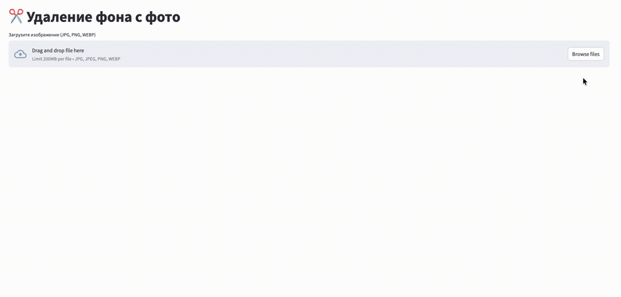

# Background Removal Service



Веб-сервис для удаления фона с фотографий: FastAPI-бэкенд с моделью `rembg`
(`isnet-general-use`, MIT) + Streamlit-интерфейс поверх него.

Обоснование выбора модели смотри в [`docs/SOTA.md`](docs/SOTA.md). Практическое
сравнение моделей на реальных фото — [`research/research.ipynb`](research/research.ipynb)

## Архитектура

Пользователь загружает фото через интерфейс на Streamlit (`frontend/app.py`).
Streamlit отправляет изображение HTTP-запросом на backend, написанный на
FastAPI (`backend/main.py`). Backend прогоняет изображение через модель rembg
и возвращает PNG с уже прозрачным фоном, далее в интерфейсе отображается
результат пользователю с возможностью скачать.

Frontend и backend — два независимых процесса, общаются по HTTP. Так backend
можно позже унести на отдельный GPU-инстанс или масштабировать очередью
запросов, не трогая UI.

## Запуск

Через Docker Compose (рекомендуется):

```bash
docker compose up --build
```

- Frontend: http://localhost:8501
- Backend + Swagger: http://localhost:8000/docs

Первый запуск дольше — backend скачивает веса модели и кэширует их
в volume `u2net-cache`.

Без Docker:

```bash
cd backend
pip install -r requirements.txt
uvicorn main:app --reload --port 8000

cd frontend
pip install -r requirements.txt
streamlit run app.py
```

## API

`POST /remove-bg` — multipart/form-data, поле `file` (jpg/png/webp, до 15 МБ), возвращает PNG с прозрачным фоном.

`GET /health` — проверка живости сервиса.

## Тесты

```bash
cd backend
pip install -r requirements-dev.txt
pytest tests/ -v
```

Результаты: успешная обработка изображения, отклонение неподдерживаемого типа
файла, пустого файла, запроса без файла, health-check.

## Смена модели

Задаётся переменной окружения `BG_REMOVAL_MODEL` (см. `docker-compose.yml`).
Варианты из `rembg`: `u2net`, `u2netp`, `isnet-general-use`, `isnet-anime`,
`silueta`. Правок кода не требует.

## Почему нет выбора модели в интерфейсе

Я рассматривала вариант дать пользователю выбирать модель прямо в Streamlit, но отказалась от него, чтобы не перегружать UI, тк большинство
пользователей не разбираются в ML-моделях и не могут оценить/ понять реальные различия и преимущества той или иной модели,
оценка только на глаз (удалился/нет фон). Как показал `research/research.ipynb`, разница между
моделями на типичных фото минимальна (оценка глазами), а на сложных случаях не всегда
однозначно в пользу более новой модели. Гибкость при этом сохранена на уровне backend — модель переключается одной
переменной окружения без правок кода.

## Предлагаемые дальнейшие шаги развития 

- Переход на BiRefNet для более высокого качества на сложных объектах
- Ограничение CORS для конкретного домена перед продакшеном
- Rate limiting / очередь задач (Celery/RQ) для нагрузки
- Аутентификация API-ключом при публичном доступе

## Главное преимущество такого решения — можно быстро запустить рабочий сервис, а модель заменить на BiRefNet при необходимости улучшения качества без изменения внешнего API.